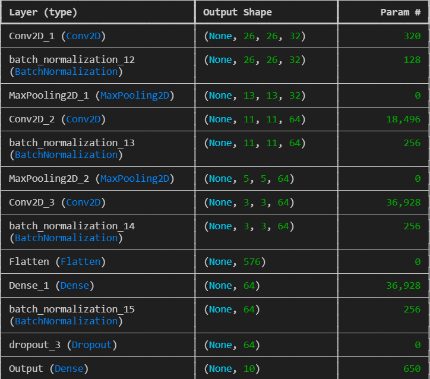
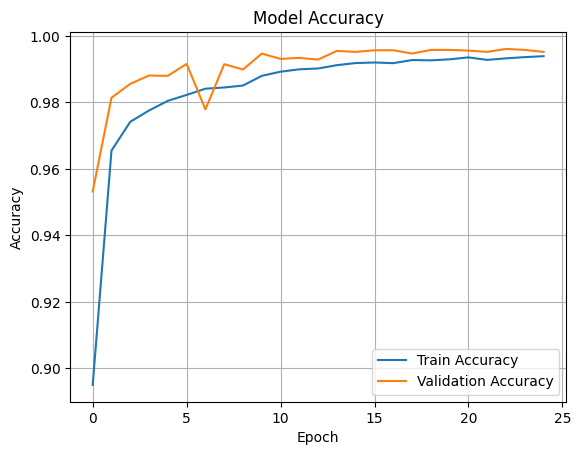
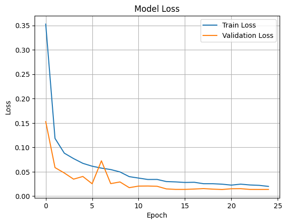
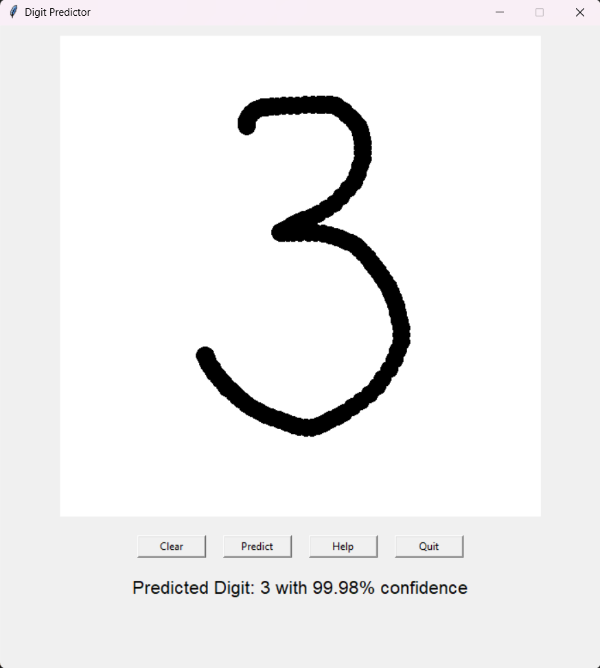
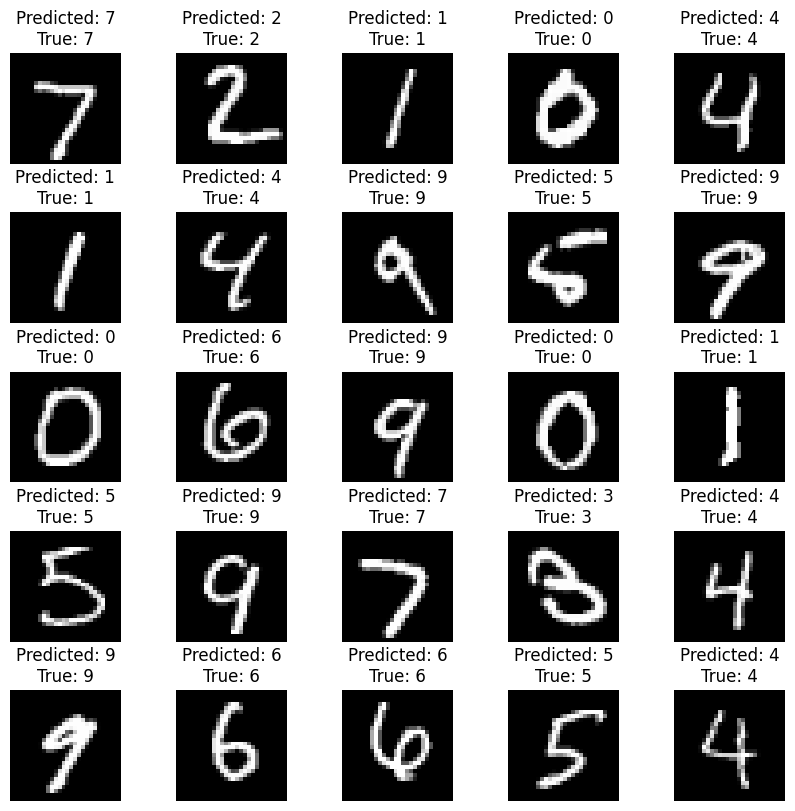
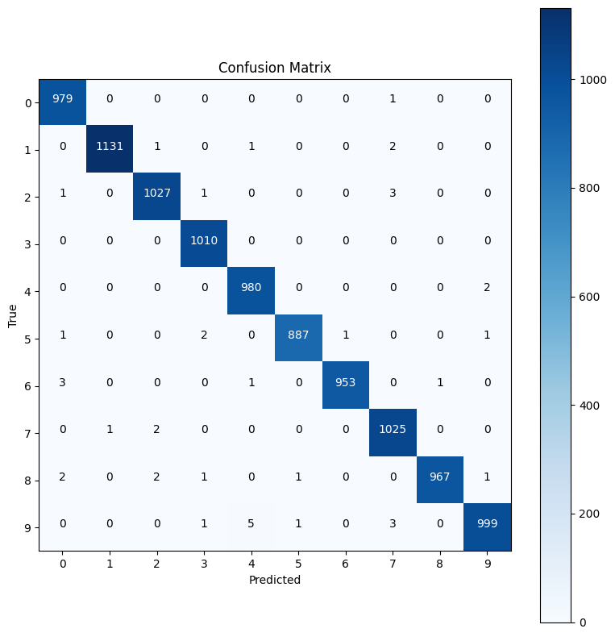

# Digit Predictor using CNN

This project is a simple implementation of a Convolutional Neural Network (CNN) trained on the MNIST dataset to recognize handwritten digits. A graphical user interface (GUI) allows users to draw a digit, and the model predicts the digit along with the confidence of the prediction.

[](https://github.com/joelmoncey/digit-recognition)

## Table of Contents
- [Introduction](#introduction)
- [Model Architecture](#model-architecture)
- [Dataset](#dataset)
- [Training Details](#training-details)
- [Usage](#usage)
- [GUI](#gui)
- [Screenshots](#screenshots)
- [Results](#results)
- [How to Run](#how-to-run)
- [Requirements](#requirements)
- [Pre-trained Model](#pre-trained-model)
- [Contributing](#contributing)
- [License](#license)
- [Final Notes](#final-notes)

---

## Introduction

This project uses a CNN model to classify handwritten digits (0-9). The model is trained on the MNIST dataset and achieves high accuracy. A graphical interface built with `tkinter` allows users to draw digits on a canvas, which are then passed to the trained model for real-time prediction.

---

## Model Architecture

The CNN model consists of multiple convolutional, pooling, normalization, and dense layers. Below is a visual summary of the model architecture:

  
*This diagram shows the layers, their configurations, and the number of parameters in the CNN model.*

Key components of the model include:
- **Conv2D**: Convolutional layers with ReLU activation for feature extraction.
- **BatchNormalization**: Normalizes the inputs to each layer, improving training stability.
- **MaxPooling2D**: Reduces spatial dimensions while retaining important features.
- **Flatten**: Converts the 2D feature maps into a 1D vector for dense layers.
- **Dense**: Fully connected layers for classification.
- **Dropout**: Randomly drops neurons during training to prevent overfitting.
- **Softmax**: Outputs probabilities for each digit class (0-9).

---

## Dataset

The model is trained on the [MNIST dataset](http://yann.lecun.com/exdb/mnist/), which consists of 28x28 grayscale images of handwritten digits (0-9). The dataset is split into:
- **Training set**: 60,000 images
- **Test set**: 10,000 images

The data is normalized to the range [0, 1] before training.

---

## Training Details

The model was trained using the Adam optimizer and categorical cross-entropy loss. It was trained for up to 30 epochs with a batch size of 64. Data augmentation techniques were applied to improve generalization:
- Rotation range: ±10°
- Zoom range: ±10%
- Width and height shift: ±10%

### Training Metrics

- **Training Accuracy**  
     
   *This plot shows the increase in training accuracy over epochs.*

- **Training Loss**  
     
   *This plot shows the decrease in training loss over epochs.*

### Callbacks
- **ReduceLROnPlateau**: Reduces learning rate when validation accuracy plateaus.
- **EarlyStopping**: Stops training if validation loss does not improve for 5 consecutive epochs.

---

## Usage

Once the model is trained, it can be used in the graphical interface (GUI) to predict digits. To use the application:

1. Draw a digit on the canvas using the mouse.
2. The model will automatically predict the digit when you release the mouse button.
3. The predicted digit and confidence percentage will be displayed.

---

## GUI

The GUI consists of:
- A canvas to draw digits.
- A **Clear** button to reset the canvas.
- A **Help** button to display instructions for use.
- A **Quit** button to close the application.

### GUI Workflow
1. The user draws a digit on the canvas.
2. The drawn image is resized to 28x28 pixels, inverted, and smoothed to match the input format of the CNN model.
3. The preprocessed image is passed to the model for prediction.
4. The predicted digit and confidence score are displayed in real-time.

---

## Screenshots

Below are screenshots of the application in action:

- **GUI Screenshot**  
     
   *The GUI includes a canvas for drawing digits, buttons for actions, and a prediction display.*

- **Sample Prediction**  
     
   *The model predicted the digit "7" with 98% confidence.*

---

## Results

### Confusion Matrix
The confusion matrix below summarizes the model's performance on the test dataset:

  
*Each cell represents the number of predictions for a specific class.*

### Evaluation Metrics
- **Test Accuracy**: 99.2%
- **Test Loss**: 0.024

Metrics per class:
| Class | Precision | Recall | F1-Score |
|-------|-----------|--------|----------|
| 0     | 0.994     | 0.996  | 0.995    |
| 1     | 0.993     | 0.995  | 0.994    |
| ...   | ...       | ...    | ...      |

---

## How to Run

1. Clone the repository:
    ```bash
    git clone https://github.com/HARIPRASADS-01/digit-recognition.git
    ```

2. Install the required dependencies:
    ```bash
    pip install -r requirements.txt
    ```

3. Run the GUI:
    ```bash
    python gui.py
    ```
    The application window will open. Draw a digit on the canvas, and the model will predict the digit.

---

## Requirements

You need the following libraries to run the project:
- tensorflow
- numpy
- pillow
- tkinter (usually pre-installed with Python)

Install them using:
```bash
pip install tensorflow numpy pillow
```
## Pre-trained Model

A pre-trained model is included in the repository (`model.h5`). You can use this model directly without retraining. To train the model yourself, refer to the [model.ipynb](model.ipynb) notebook.


## Contributing

Contributions are welcome! Please follow these steps:

1. Fork the repository.
2. Create a new branch for your feature/fix.
3. Submit a pull request with a detailed description of your changes.
